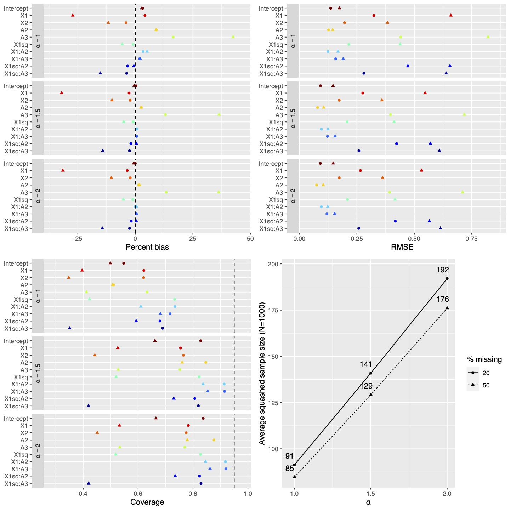

```{r setup, include=FALSE}
library(knitr)
opts_chunk$set(echo = FALSE, eval=TRUE)
xaringanExtra::use_freezeframe()

```
---
# Overview

- **Chapters 1 & 2**: 

  1. Optimal BIS reference functions for closed-loop induction of anesthesia with propofol
  2. Illustrated with R Software package, `tci` (target-controlled infusions)
  
--

- **Chapter 3**: Data squashing with missing values

---
class: center, middle

# Chapter 1: Optimal BIS reference functions for closed-loop induction of anesthesia with propofol

---
## Background - Automation of Anesthesia

- Automation of drug delivery has been a long-standing goal within anesthesia

--

- A computerized pump, rather than an anesthesiologist, would deliver infusions

--

- Used to maintain constant concentration, but also to **induct anesthesia**

--

- The anesthesiologist focuses on higher-level tasks, less human error, more fine-tuned control

<!-- -- -->

<!-- - Analogous to autopilot* in planes: maintains speed/altitude, smoother takeoff, conserve fuel -->

<!-- .footnote[*Loeb and Cannesson (2017)] -->

???
So what stands in the way of making this happen
Many things - anesthesia is complicated

---
## Difficulties


- Many drugs are administered simultaneously, with interactions

--

- May have narrow therapeutic ranges

--

- Consequences of over- and under-dosing with anesthetic propofol (e.g., cardiovascular effects, delirium, interoperative awareness)

--

- **Substantial interpatient pharmacokinetic-pharmacodynamic (PK-PD) variability**

--

- Models can adjust for covariates, but variability remains

???
I'll begin by illustrating the degree to which interpatient variability is unexplained and can impact patient responses.

---
## Illustration of interpatient variability

- 10 patients are being inducted into general anesthesia with propofol 

--

- Model* adjusts dosage for sex, age, BMI

.footnote[*Eleveld et al. (2018) population PK-PD model]
--

- Depth of anesthesia is measured by the Bispectral index (BIS)

.center[
```{r, bis-image, out.width = 270, out.height = 180, fig.pos="center", fig.cap="https://commons.wikimedia.org/wiki/File:BIS_JPN.jpg"}

```
]

--

- Doses are calculated a target of BIS=50 (40-60 are acceptable)

--

- Avoid overshoot (BIS<40), delays, excessive medication 


---
## Simulated responses without feed-back ("open-loop")

.center[

]

- Graphics created in R using `tci` and `gganimate`

???

So what are we seeing here...?

1. Simulated inductions of anesthesia for 10 patients with different covariates
2. Y axis shows Bispectral index value (0-100), targets 50 for general anesthesia
3. Top panel is what the model thinks is happening based on covariate values alone
4. Middle panel shows true responses due to unobserved PK-PD variability
5. Bottom panel shows infusion rates -- designed to reach target 50 as quickly as possible without overshooting
---
## Open-loop takeaways

- Substantial "unexplained" PK-PD variability exists after covariate adjustment

--

- Need to gather patient-specific data

--

- **Solution:** closed-loop control


---
## Background - Closed-loop control

- Feedback from a patient (e.g., BIS) are collected in real time (1 obs/10 sec)

--

- "Closed-loop" controller estimates the current state of the patient and the distance to a "reference point" (e.g., BIS=50)

--

- Target-controlled infusion (TCI) device calculates the infusion rate required to reach target

--

.center[
```{r, tci-image, out.width = 300, out.height = 240, fig.pos="center", fig.cap="https://commons.wikimedia.org/wiki/File:Syringe_pump,_Lambda_VIT-FIT.jpg"}
knitr::include_graphics("images/Syringe_pump.jpeg")
```
]


---
## Example - Bayesian closed-loop controller

.center[

]


---
## Simulated responses with closed-loop control

- Ability to update in real time to patient responses

--

- How do our 10 simulated patients do with CLC?


---
## Closed-loop controller, reference value: BIS = 50

.center[

]

---
## Closed-loop takeaways

- Large doses are administered at the start

--

- Overshoot occurs and can't be prevented

--

- Patients are sedated quickly, **BUT...**

--

  1. Overdose some patients
  2. Take longer to stabilize in desired range
  3. Use excessive medication
  
--

- **Solution:** time-varying reference function
  

---
## Closed-loop controller with reference function

.center[

]


---
## Optimal reference function

- How do we identify a reference function that results in optimal outcomes for patients?

--

- Approached as an optimal design of experiments problem

--

- Asks *"how best can can I, the experimenter, select inputs into a system to achieve a desired outcome."*


- The input that we can modify is the set of targets (i.e., a procedure for determining infusion rates)


---
## Optimal reference function: functional form

- A range of functions could be selected

--

- Flexible, low-dimensional, montonically decreasing

--

- Exponential and sigmoidal functions fit criteria

--

- Can allow for initial bolus, followed by gradual infusions by varying y-intercept

---
## Optimal reference function

"Optimal" depends on what we are interested in

--

.center[
```{r, objective-functions, out.width = 400, out.height = 300}

```
]

1. Combination of over-shoot and under-shoot (WOS)

2. Stable entry time (SET)

3. Total dose (TD)

---
## Optimal reference function

- For each criteria, each person has a single value

--

- For a population of patients, there a distribution of individual-level criterion values

--

- As the the reference function changes, so does the distribution of values

--

- We select the reference function to optimize some characteristic of the distribution

--

- 1) Average stable entry time, 2) variance of stable entry time, 3) average dose


---
## Simulation

- Synthetic data set constructed of $N=122$ patients used to develop Eleveld population PK-PD model

--

- "True" patient parameters are formed from posterior mode parameter estimates

--

- Unknown to closed-loop controller, but are used to simulate data generation

--

- "Predicted" patient parameters are based on observed covariates and updated as data are collected

--

- Data are split into training set of $N_{\text{train}}=50$ patients used to identify optimal RF, and $N_{\text{test}}=72$ patients to evaluate performance


---
## Reference function optimization

- Evaluate grid of reference function parameters

--

- Run simulation 3x to account for Monte Carlo error

--

- Calculate average criterion performance over iterations

---
## Optimized reference functions

.center[
```{r, optimized-targets, out.width = 650, out.height = 500}

```
]


---
## Optimized reference functions

.center[
```{r, optimized-targets-2, out.width = 650, out.height = 500}

```
]

---
## Test set performance
.center[
```{r, rf-performance, out.width = 750, out.height = 380}
knitr::include_graphics("./images/ReferenceFunctionPerformance.png")
```
]

---
## Test set performance
.center[
```{r, rf-performance-set, out.width = 750, out.height = 380}
knitr::include_graphics("./images/ReferenceFunctionPerformanceSET.png")
```
]

---
## Test set performance - Stable Entry Time

.center[
```{r, results-set, out.width = 500, out.height = 500}

```
]


---
## Test set performance - Stable Entry Time

.center[
```{r, results-km, out.width = 800, out.height = 400}
knitr::include_graphics("./images/kaplan-meier.jpeg")
```
]


---
## Test set performance
.center[
```{r, rf-performance-td, out.width = 750, out.height = 380}

```
]

---
## Test set performance - Total Dose

.center[
```{r, results-td, out.width = 500, out.height = 500}

```
]


---
## Test set performance - Total Dose

.center[
```{r, dose-difference, out.width = 500, out.height = 500}
knitr::include_graphics("./images/dose-difference.jpeg")
```
]


---
## Discussion

**Highlights**

1. New approach to considering clinical objectives in presence of interpatient PK-PD variability

--

2. Can improve across multiple criteria by delaying initial rapid infusions

--

3. Reference functions can be used by any closed-loop controller

--

4. Can be optimized and put in place prior to first dose


---
## Discussion

**Limitations**

1. Reference function will be suboptimal if population is not adequately described by population PK-PD model (e.g., interpatient variability estimates are inaccurate, sources of variability beyond model)

--

2. Performance may vary for different controllers

--

3. Optimization process is computationally intensive, **but...**

--

- May not be as bad for all controllers (i.e., those that don't require posterior estimation)

---
## TCI software package

1. Implements TCI algorithms to identify infusion rates

--

2. Simulates patient data from PK or PK-PD models given dosing schedules

--

3. Allows for feedback through closed-loop control

---
## TCI software package

- No easy to use software currently exists

--

- Existing programs are either proprietary or not easily modifiable (e.g., STANPUMP is written in C and intended for Windows 95/98)

--

- `tci` is freely available, in R, and is highly customizable: user-specified models, TCI algorithms

--

- Future versions will use `Rcpp` and offer broader support for closed-loop control


---
class: center, middle

# Chapter 3: Data squashing with missing values

---
## Overview

- Original squashing method

--

- Extensions to data sets with missing values
  1. Propagation squashing
  2. Expectation squashing

---
## Introduction - Data squashing

- Proposed by DuMouchel et al. (1999)

--

- Goal is to replace a large data set with a much smaller, "squashed" data set

--

.center[
```{r, squash-data-example, out.width = 450, out.height = 200}
knitr::include_graphics("./images/squash_data_example.png")
```
]

--

- $d_i$ is a vector of covariates for the ith row

--

- $d^*_i$ is "pseudo-data" with the same covariates, but made up values

--

- $d^*$ is constructed so that models fit to $d^*$ will give (approximately) the same results as when fit to $d$


---
## Iris data example

.center[
```{r, iris-squash-data-example, out.width = 600, out.height = 400}
knitr::include_graphics("./images/squash_iris.png")
```
]

- Reduction factor: 8.3
- Squashed points are constructed, not sampled

---
## How does data squashing work?

- **If likelihood functions are the same, the results will be also**

$$\sum_{i=1}^N \log(f(d_i|\theta)) = \sum_{j=1}^M w_j^*\log(f(d_j^*|\theta))$$
--

- $N$ is the original sample size, $M$ is squashed sample size

--

- Goal is to find values $d_j^*$, $w_j^*$ to make this equality true


---
## How does data squashing work?

- Split data, $d$, into quantitative variables, $X_1,...,X_Q$, and categorical variables, $A_1,...,A_C$

--

- Within categorical regions, take Taylor series approximation as a function of the data at $d=\mu$

$$\sum_{i=1}^{N_r}\log(f(X_{i1},...,X_{iQ}|A=a, \theta)) \approx \sum_{i=1}^{N_r}\sum_{k=1}^K g_k \prod_{j=1}^Q (X_{ij} - \mu_j)^{p_{kj}}$$
--

- $K$ terms in Taylor approximation, $N_r$ observations in region $r$

--

- Precision of approximation increases with higher $K$, determined by degree of approximation, $d$

--

- $p$ denotes all vectors such that $\sum_{j}p_{kj} \le d$


---
## Example expansion

- Let $Q = d = 2$

--

- Possible power vectors such that $\sum_{j}p_{kj} \le 2$

$$\mathbf{p} = \{(0,0),(1,0),(0,1),(2,0),(0,2),(1,1)\}$$
--

- Results in expansion with $K=|\mathbf{p}| = 6$ terms

\begin{equation}
  \begin{aligned}
  \sum_{k=0}^5 g_k \prod_{j=1}^2(X_{ij}-\mu_j)^{p_{kj}} &= 
  g_0 + 
  g_1(X_{i1} - \mu_1) + 
  g_2(X_{i2} - \mu_2) + \\
  & ~~~~~ g_3(X_{i1} - \mu_1)^2 + g_4(X_{i2} - \mu_2)^2 + \\
  & ~~~~~ g_5(X_{i1} - \mu_1)(X_{i2} - \mu_2)
  \end{aligned}
\end{equation}

--

- Results in scaled sample moments when summed


---
## How does data squashing work?

- **If moments are matched between original and squashed data sets, the likelihood functions will be (approximately) equal!**

--

- True for *any* likelihood

--

- **Procedure:** Group data into local regions and construct squashed sample to have the same moments as the original data


<!-- --- -->
<!-- ## How does data squashing work? -->

<!-- -- -->

<!-- - Plug in Taylor expansion and switch order of summation ($Nr$ and $K$) -->

<!-- \begin{equation} -->
<!-- \sum_{k=1}^K g_k \sum_{i=1}^{N_r}\prod_{j=1}^Q(X_{ij}-\mu_j)^{p_{kj}} = \sum_{k=1}^K g_k \sum_{i=1}^{M_r}w_i\prod_{j=1}^Q(Y_{ij}-\mu_j)^{p_{kj}}  -->
<!-- \end{equation} -->

<!-- -- -->

<!-- - Equality will hold if it holds for each moment -->

<!-- \begin{equation} -->
<!-- \sum_{i=1}^{N_r}\prod_{j=1}^Q(X_{ij}-\mu_j)^{p_{kj}} = \sum_{i=1}^{M_r}w_i\prod_{j=1}^Q(Y_{ij}-\mu_j)^{p_{kj}} -->
<!-- \end{equation} -->

<!-- -- -->

<!-- - **If moments are matched between original and squashed data sets, the likelihood functions will be (approximately) equal!** -->

<!-- -- -->

<!-- - True for *any* likelihood -->

<!-- --- -->
<!-- ## Squashing Procedure -->

<!-- -- -->

<!-- 1. Group numeric variables within categories -->

<!-- -- -->

<!-- 2. Select set of moments to match: up to 4th order -->

<!-- -- -->

<!-- 3. Select size of squashed sample: $M_r = \max(1,\alpha \log(N_r))$ -->

<!-- -- -->

<!-- 4. Minimize squared distance between sample moments and squashed weighted moments -->


---
## Why does no one use data squashing?

Impressive performance in examples, but...

--

1. Doesn't scale well with even moderate numbers of categorical levels

--

2. No software

--

3. **No mechanism for missing values**


---
## Propagation squashing (P-squashing)

- Squash data set while propagating missingness patterns to the squashed data set

--

- Preserves information required for likelihood-based missing data routines

--

- Missing data procedures can be applied to squashed data set

---
## Propagation squashing (P-squashing)

- Motivated by full-information maximum likelihood (FIML)

--

- Calculates a separate likelihood for each missingness pattern by marginalizing over distribution of missing values

--

- Handles missing data and fits model in single step (in contrast to multiple imputation)


---
## P-squashing - FIML

**Example:** Data are fully observed on two numeric variables, $X_{obs}$ and $X_{mis}$ for first $M$ observations; $X_{mis}$ is missing for last $N-M$ observations

--

- Ordinary likelihood

$$L = \prod_{i=1}^N f_i(x_{i,obs},x_{i,mis}|\theta)$$
--

Marginal likelihood for observations missing $X_{mis}$

$$f_i^*(x_{i,obs}|\theta) = \int f_i(x_{i,obs},x_{i,mis}|\theta) d x_{mis}$$
--

Likelihood for all observations is the product of the two components

$$L^{FIML} = \prod_{i=1}^Mf_i(x_{i,obs},x_{i,mis}|\theta) \prod_{i=M+1}^N f^*_i(x_{i,obs}|\theta)$$

---
## P-squashing

- How do we apply P-squashing to this?

--

Log likelihood

$$\log(L^{FIML}) = \sum_{i=1}^M \log f_i(x_{i,obs},x_{i,mis}|\theta) + \sum_{i=M+1}^N \log f^*_i(x_{i,obs}|\theta)$$

--

- Define regions to have constant missingness patterns and evaluate Taylor series on fully observed 

--

$$\log(L^{FIML}) \approx \sum_{i=1}^M \sum_{k=1}^{K_1}g_{k1}(x_{i,obs} - \mu_{obs,1})^{p_{k1}}(x_{i,mis} - \mu_{mis})^{p_{k2}} \\ + \sum_{i=M+1}^N \sum_{k=1}^{K_2}g_{k2}(x_{i,obs} - \mu_{obs,2})^{p_{k1}}$$

--

- Subscripts 1 and 2 for $K, \mu, p$ denote values changing between fully-observed and partially-observed regions of the data  

--

- A different set of moments are calculated for each term

---
## Implementation of P-squashing

- Simple modification of original squashing method

--

- Define a categorical variable indicating missingness pattern

--

- Treat NAs in categorical variables as a separate category

--

- Regions are split, by default, based on categorical levels

--

- This ensures that each numeric variable will be either fully observed, or fully missing in each region

--

- Squashed data set is constructed to have NAs in same locations as original data set


---
## P-squashing performance - Simulations

- Generate 2,000 data sets of size $N=1,000$

--

- Two numeric predictors, $X_1, X_2$, and one categorical, $A$

--

- Outcome $Y$ generated 

$$\begin{aligned} Y &= 5+ 2X_1 - X_1^2 + 3A_2 + 5A_3 +3X_2 +5X_1 A_2 - X_1 A_3 - 2X_1^2 A_2 + X_1^2 A_3+ \epsilon \\ \epsilon &\sim N(0,4) \end{aligned}$$


---
## P-squashing performance - Simulations

.center[
```{r, p-squash-sim, out.width = 500, out.height = 500}
knitr::include_graphics("./images/sim_res_miss.jpeg")
```
]


---
## Expectation squashing (E-squashing)

- Squashes the expectation of the log-likelihood, with respect to the missing data

--

Log-likelihood with observed ("O") and missing ("M") variables

$$E_{X_M,A_M}[\text{log}L(\theta|X,A)] = \sum_{i=1}^N E_{X_M,A_M}[\log(f(X_{iO},X_{iM},A_{iO},A_{iM}))]$$

--

- Squashing occurs in local regions (i.e., within constant categories, numeric clusters) for accuracy of Taylor approximation

--

- With missing values, $X_M, A_M$, it is unclear which regions they should be assigned to

---
## E-squashing

- Define region assignment operator, $\phi$, and region indicator, $Z$

$$\phi(X_i,A_i) = r \in 1,...,R$$
$$Z_{ir} = \begin{cases} 1 & \text{if} ~\phi(X_i , A_i) = r \\ 0 & \text{otherwise}\end{cases}$$

- Define complete-data log likelihood

$$\text{log} L(\theta|X,A) = \sum_{r=1}^R \sum_{i=1}^{N_r} Z_{ir} \log(f(X_{iO},X_{iM}|A=a))$$

- Expectation of complete-data log likelihood

$$\begin{aligned}E_{X_M,A_M}[\text{log} L(\theta |X,A)] &= \sum_{r=1}^R \sum_{i=1}^{N_r} E_{X_M,A_M}[Z_{ir}] E_{X_M|A_M}[\log(f(X_{iO},X_{iM}|A=a))] \\ &... \\ &\approx \sum_{r=1}^R \sum_{i=1}^{N_r}p(A_{iM}= a_{iM}|x_{iO},a_{iO})p(\phi = r|x_{iO},a_{iO},a_{iM}) \\
  & ~~~~~~~~~\cdot \sum_{k=1}^K g_k \cdot E_{X_M}\left[\prod_{j=1}^{u(\xi)}(X_{ij}-x_j)^{p_{kj}}\right] \end{aligned}$$

--

1. Probability of missing categorical variables falling in each category

--

2. Probability of belonging to each numeric cluster given fully-observed categories

--

3. Expected value of moments with respect to missing numeric values


---
## E-squashing procedure - 1. Expand categorical variables 

- Missing values are expanded to include all possible values and weighted according to probability of belonging in each group

.center[
```{r, cat-expansion, out.width = 600, out.height = 200}

```
]


---
## E-squashing procedure - 2. Group and expand numeric variables

- *Assume that regions can be formed from fully-observed observations*

--

.center[
```{r, numeric-expansion1, out.width = 400, out.height = 200}

```
]

---
## E-squashing procedure - 2. Group and expand numeric variables

- Calculate probability that observations with missing values belong to each region

--

- Assume values are multivariate-normally distributed

--

- Assign points to each region


.center[
```{r, numeric-expansion2, out.width = 608, out.height = 191}
knitr::include_graphics("./images/numeric_expansion2.jpeg")
```
]


---
## E-squashing procedure - 3. Calculate expected moments

- Calculate weighted moments

.center[
```{r, moment-calculation, out.width = 266, out.height = 81}
knitr::include_graphics("./images/group1_example.jpeg")
```
]

--

- All available information is used for each moment


---
## E-squashing simulation performance

.center[
```{r, e-squash-sim, out.width = 500, out.height = 500}

```
]


---
## New York workers' compensation data set

- Workers' compensation claims filed in New York, January 1, 2000 to June 8, 2021 (available at https://data.ny.gov/Government-Finance/Assembled-Workers-Compensation-Claims-Beginning-20/jshw-gkgu)

--
- 2.2 million records on 11 variables*, maximum of 53\% missing on workers' industry

.footnote[*After pre-processing steps]

--

- Claims by workers for lost wages due to illness or injury during the course of employment

--

- Large enough to be extremely cumbersome to work with

---
## Analysis

- Interest in the impact of Covid-19 on workers' comp. claims

--

- Economic downturns usually impact the quantity and composition (fewer claims, more severe)

.footnote[*KMPG,2020]
--

- Covid-19 may have exacerbated this: backlogs due to closure of courts, reluctance or inability to seek medical care

--

- 1) Indicator that claim is Covid-related, 2) indicator that claim was assembled after March 1, 2020


Research questions: 

1. Has Covid-19 resulted in delays between claim assembly and claim verification?

--

2. Has Covid-19 increased the severity of claims (medical only vs. temporary disability vs. permanent disability/death)?


---
## Data sets

1. Full data, N=2,191,006
2. P-squashed data set, N=32,027 ($\alpha=1.5$, reduction factor = 68.4)
3. E-squashed data set, N=27,660 ($\alpha=2$, reduction factor = 79.2)
4. Simple random sample, N=32,000


---
## Analysis 1 - Time between assembly and verification date

- Outcome is logged difference in time, fit with multiple linear regression

--

- All second-order terms and interactions used as predictors

--

- FIML used to handle missing values


---
## Analysis 1 - Time between assembly and verification date

.center[
```{r, squash-analysis-1-fp, out.width = 565, out.height = 479}
knitr::include_graphics("./images/fiml_o2_fp.jpeg")
```
]


---
## Analysis 1 - Time between assembly and verification date

.center[
```{r, squash-analysis-1-stats, out.width = 565, out.height = 300}

```
]

---
## Analysis 1 - Time between assembly and verification date

**Conclusion:** Claims after March 1, 2020 were processed more quickly **BUT**-- this was less pronounced when claims were marked as Covid-19 related.


<!-- **Effect post March 1, 2020** -->

<!-- full data: -0.482 [-0.491, -0.474]  -->
<!-- p-squash: -0.483 [-0.491, -0.475]  -->
<!-- e-squash: -0.466 [-0.475, -0.458]  -->
<!-- sample: -0.506 [-0.572, -0.440] -->

<!-- -- -->

<!-- **Effect of Covid-19 related indicator** -->

<!-- full data: 0.224 [0.196,0.254]  -->
<!-- p-squash: 0.223 [0.193,0.252]  -->
<!-- e-squash: 0.211 [0.182, 0.241]  -->
<!-- sample: 0.264 [0.049, 0.480] -->


---
## Analysis 2 - Severity of workers' comp. claim

- Outcome is ordinal claim severity (medical only vs. temporary disability vs. permanent disability/death)

--

- All second-order terms and interactions used as predictors

--

- MI used to handle missing values (10 imputations each)

---
## Analysis 2 - Severity of workers' comp. claim

.center[
```{r, squash-analysis-2-fp, out.width = 565, out.height = 479}
knitr::include_graphics("./images/ord_o2_fp.jpeg")
```
]


---
## Analysis 2 - Severity of workers' comp. claim

.center[
```{r, squash-analysis-2-stats, out.width = 565, out.height = 300}

```
]

---
## Analysis 2 - Severity of workers' comp. claim

**Conclusion:** Both claims marked as Covid-19 related and claims assembled March 1, 2020 tended to be associated with **less severe** outcomes

--

**Effect post March 1, 2020**

full data: -0.482 [-0.491, -0.474] 
p-squash: -0.483 [-0.491, -0.475] 
e-squash: -0.466 [-0.475, -0.458] 
sample: -0.506 [-0.572, -0.440]

--

**Effect of Covid-19 related indicator**

full data: 0.224 [0.196,0.254] 
p-squash: 0.223 [0.193,0.252] 
e-squash: 0.211 [0.182, 0.241] 
sample: 0.264 [0.049, 0.480]


---
## Conclusions

1. P-squashed estimates were highly similar to full-data estimates

--

2. E-squashed estimates had similar bias as the random sample, but anti-conservative standard errors when numeric data were missing

--

3. Both are viable options when working with large data with missing values, but more work is required


---
# References

Eleveld, D. J., Colin, P., Absalom, A. R., and Struys, M. M. R. F. (2018).  Pharmacokinetic-pharmacodynamic model for propofol for broad application in anaesthesia and sedation. British Journal of Anaesthesia, 120(5):942–959

KPMG (2020), The Impact of COVID-19 on Workers’ Compensation, 1–34.

Loeb, R. G. and Cannesson, M. (2017), Closed-loop anesthesia: Ready for prime time?, Anesthesia and Analgesia 124(2), 381–382.


---
# Acknowledgements


---
## E-squashing theory

- First term: expectation of that observation $i$ is assigned to region $r$

--

- Make **assumption** that regions are defined *without reference to the missing values*

--

Expectation of region indicator

$$\begin{aligned} E_{X_M,A_M}[Z_{ir}] &= p(\phi(X_i,A_i) = r) \\ &= p(\phi(X_{iM},A_{iM},x_{iO},a_{iO}) = r|x_{iO},a_{iO}) \\ &= p(A_{iM}= a_{iM}|x_{iO},a_{iO})p(\phi(X_{iM},a_{iM},x_{iO},a_{iO}) = r|x_{iO},a_{iO},a_{iM}) \\ \end{aligned}$$


<!-- 
Learn more about:

1. FIML
  - FIML uses information from all available observations
  - Maximizes likelihood containing fully observed values in each pattern
  - Ordinarily would just take the derivative of the log-likelihood wrt parameters, but in general don't have a closed-form -> iterative solution
2. EM algorithm applied to FIML
  - Calculate expectation of missing values w.r.t observed value


3. Taylor expansion of log-likelihood about the data (vs about the parameters)
4. Asymptotic normality of MLE


-->


<!-- - Currently, an anesthesiologist will manually deliver bolus doses and infusions to achieve a desired response. -->
<!--   - Many drugs simultaneously -->
<!--   - Dynamics of and interactions between drugs are difficult to predict -->
<!--   - Narrow therapeutic ranges -->
<!-- - Automation through "closed-loop" systems -->
<!--   - Patient feedback (e.g. EEG signal) is fed back into system -->
<!--   - Reduced workload, less human error, more precise control -->

<!-- ## Background - Automation of anesthesia -->

<!--   - Induction of anesthesia is difficult to automate -->
<!--   - Goal is to rapidly bring a patient to the target level of anesthesia -->
<!--   - Precise dose is unknown due to interpatient variability -->
<!--   - Target under- and over-shoot have consequences -->
<!--   - **How can we optimally induct patients under closed-loop control in the presence of interpatient variability?** -->


<!-- ## Optimal design of experiments -->

<!-- - ODE approach: "what levers exist in the system that we can pull to elicit a desired outcome?" -->
<!-- - Example levers: timing of blood draws, temperatures, ... -->
<!-- - Example outcome: observations that minimize the average prediction variance -->

<!-- - Under CLC, measurements of patient awareness are gathered continuously (every 10-15 seconds) -->
<!-- - Levers: infusion rates, or response targets that are translated into infusion rates -->
<!-- - Outcome: clinical performance of CLC in heterogeneous population -->


<!-- -------------------------------------------------------------------- -->
<!-- -------------------------------------------------------------------- -->
<!-- -------------------------------------------------------------------- -->

<!-- # Paper 2 -->

<!-- <!--  -->
<!-- Outline  -->

<!-- - Need for TCI and current dearth of software -->
<!-- - Explain existence/possibility of alternate TCI algorithms, applied in different settings -->
<!-- - Illustrate basic functionality  -->
<!-- - Illustrate extension to PD model -->
<!-- - Alternate TCI algorithm -->
<!-- --> -->


